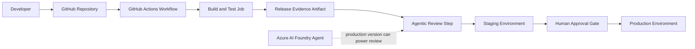

# Agentic DevOps Architecture

## Plain-English Architecture

Agentic DevOps means adding AI agents into the software delivery process so they can analyze evidence, summarize risk, recommend actions, and help teams respond faster. The important design rule is that agents should not silently bypass governance. They should work inside the pipeline controls that already protect production.

This POC uses GitHub Actions as the CI/CD orchestrator and Azure AI Foundry as the platform concept for hosting the agent intelligence.

## Architecture Flow

## Pattern 1: Agent as Advisor

The agent reviews release evidence such as tests, vulnerability counts, change size, and deployment target. It produces a recommendation, but it does not own production approval.

Use this when teams want AI help without weakening control.

## Pattern 2: Agent as CI/CD Orchestrator Assistant

The CI/CD platform remains the orchestrator. The agent assists by:

- Reading logs and test results.
- Producing release summaries.
- Scoring deployment risk.
- Explaining why a release should proceed or stop.
- Creating human-readable approval context.

## Pattern 3: Human-in-the-Loop Gate

The production environment is protected by a required reviewer. This means even if the agent recommends proceeding, a human must approve production deployment.

This is the most important governance message in the demo: AI can accelerate judgment, but production authority should be policy-bound.

## Pattern 4: Scaling Across Teams

Large organizations can scale the pattern by standardizing:

- Reusable GitHub Actions workflows.
- Shared approval environments such as staging and production.
- Common agent prompts and evaluation criteria.
- Azure RBAC and least-privilege access.
- Central logging, audit trails, and review artifacts.
- Platform-owned templates for product teams.

## How Azure AI Foundry Fits

Azure AI Foundry is the platform layer for building, managing, evaluating, and operating AI apps and agents. In this architecture, Foundry can provide:

- Model deployment for the agent.
- Agent instructions and tools.
- Prompt testing in the playground.
- Evaluation of agent quality.
- Monitoring and tracing.
- RBAC and project-level organization.

In the POC workflow, the agent review is deterministic so screenshots are repeatable. In a production version, the same step can call an Azure AI Foundry agent to review richer release evidence.
