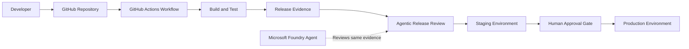

# Agentic DevOps: Architecture Patterns, AI-Powered CI/CD Orchestration, Human Approval Gates, and Scaling Across Teams

## Abstract

Agentic DevOps is the practice of adding AI agents into the software delivery lifecycle so they can reason over pipeline evidence, summarize risk, recommend next actions, and help teams operate faster. The goal is not to remove DevOps governance. The goal is to make governance smarter, more explainable, and easier to scale.

This article presents a practical proof of concept using GitHub Actions and Microsoft Foundry. GitHub Actions is used as the CI/CD orchestrator. Microsoft Foundry is used as the AI agent platform. The production deployment remains protected by a human approval gate, proving a core principle of enterprise Agentic DevOps: AI agents may advise, but policy and human accountability must control production release authority.

The demo was built to address four assigned work items:

| Work Item | Topic | How This Article Covers It |
| --- | --- | --- |
| 1884 | Agentic DevOps architecture patterns | Defines practical architecture patterns and shows a working reference flow |
| 1885 | AI agents for CI/CD orchestration | Demonstrates an agentic release review step in a CI/CD workflow |
| 1887 | Human approval gates in agentic pipelines | Shows GitHub environment protection rules pausing production deployment |
| 1890 | Scaling Agentic DevOps across teams | Explains reusable workflows, RBAC, shared guardrails, and platform team ownership |

## Screenshot Placeholders

Replace each placeholder below with the screenshots captured during the demo.

| Figure | Screenshot |
| --- | --- |
| Figure 1 | Repository homepage: `agentic-devops-poc` |
| Figure 2 | GitHub Actions workflow YAML |
| Figure 3 | GitHub environments showing `staging` and `production` |
| Figure 4 | Production environment required reviewer rule |
| Figure 5 | Manual workflow run waiting for production approval |
| Figure 6 | Agentic release review summary |
| Figure 7 | Approval dialog for production deployment |
| Figure 8 | Completed workflow run after approval |
| Figure 9 | Azure resource group `rg-agentic-devops-poc` |
| Figure 10 | Foundry resource `balop3e-agentic-foundry` |
| Figure 11 | Foundry project `agentic-devops-poc` |
| Figure 12 | Model deployment `gpt-4o-mini-agentic` |
| Figure 13 | Agent `devops-release-review-agent` |
| Figure 14 | Foundry playground response reviewing GitHub release evidence |

## 1. Introduction

Modern DevOps teams are under constant pressure to ship faster while keeping production stable, secure, and auditable. Traditional CI/CD pipelines are good at executing predefined steps: build, test, scan, package, deploy. However, pipelines are usually weak at interpreting context. A pipeline can tell us that tests passed, but it may not explain whether a small coverage drop, a dependency change, and a production deployment together create meaningful release risk.

This is where AI agents can help. An AI agent can review release evidence, summarize what changed, explain risk in plain language, and prepare useful context for human approvers. In an enterprise DevOps environment, this is powerful because release decisions often require both technical evidence and judgment.

The key is to use agents responsibly. A good Agentic DevOps design does not allow an AI agent to silently deploy to production. Instead, the agent acts as an advisor inside an existing governance structure. The CI/CD platform still controls execution, and approval policies still decide when production can be touched.

In this proof of concept, GitHub Actions orchestrates the pipeline, Microsoft Foundry hosts the AI agent capability, and GitHub Environments enforce the production approval gate.

## 2. Demo Summary

The proof of concept repository is:

`https://github.com/balop3e/agentic-devops-poc`

The repository is public because GitHub Free supports environment protection rules for public repositories. This is important for the demo because the production approval gate depends on GitHub environment reviewers.

The repository contains:

- A small Python application.
- Unit tests.
- A GitHub Actions workflow.
- A deterministic agentic release review script.
- Documentation explaining the architecture.
- Foundry agent instructions used for the AI agent demo.

The Azure resources created for the Foundry portion are:

| Resource | Name |
| --- | --- |
| Resource group | `rg-agentic-devops-poc` |
| Foundry resource | `balop3e-agentic-foundry` |
| Foundry project | `agentic-devops-poc` |
| Model deployment | `gpt-4o-mini-agentic` |
| Agent | `devops-release-review-agent` |

The main GitHub Actions run used for the demo was:

`https://github.com/balop3e/agentic-devops-poc/actions/runs/26004241887`

## 3. Architecture Overview

The architecture uses a human-in-the-loop Agentic DevOps pattern.



At a high level:

1. A developer triggers a workflow from GitHub.
2. GitHub Actions checks out the code, installs dependencies, and runs tests.
3. The pipeline creates release evidence.
4. An agentic review step analyzes the release evidence and produces a recommendation.
5. The staging deployment runs automatically when the release evidence is healthy.
6. The production deployment waits for a human approval gate.
7. A Foundry agent reviews the same release evidence and demonstrates how the deterministic pipeline step can evolve into a real AI-backed release review capability.

**Figure 1: Repository homepage showing `agentic-devops-poc`.**

`[Insert screenshot: repository homepage]`

## 4. Agentic DevOps Architecture Patterns

### 4.1 Agent as Advisor

The simplest and safest architecture pattern is the advisor pattern. In this pattern, the AI agent does not directly control production. It reviews evidence and produces a recommendation.

In the demo, the release review output included:

- Risk level.
- Risk score.
- Deployment recommendation.
- Evidence reviewed.
- Reasoning.
- Reminder that human approval is still required.

This pattern is useful because it improves human decision-making without weakening governance.

### 4.2 Agent as CI/CD Assistant

In this pattern, the CI/CD platform remains the orchestrator, but the agent assists with interpretation.

The agent can:

- Summarize build and test outcomes.
- Review vulnerability findings.
- Explain deployment risk.
- Highlight missing release information.
- Generate approval notes.
- Recommend whether to proceed, pause, or block.

The pipeline still decides which job runs next. The agent provides intelligence, but GitHub Actions remains the execution engine.

### 4.3 Human-in-the-Loop Gate

The human-in-the-loop pattern is essential for production systems. Even when the agent recommends proceeding, production deployment still requires approval from a human reviewer.

This protects the organization from:

- Incorrect AI recommendations.
- Missing business context.
- Last-minute operational risks.
- Compliance gaps.
- Unreviewed production changes.

In this demo, GitHub Environments provided the gate. The `production` environment required a reviewer before the production job could run.

### 4.4 Agentic Governance Pattern

Agentic governance means the agent works within a defined control model. The model should include:

- Role-based access control.
- Approval rules.
- Auditable review outputs.
- Reusable workflow templates.
- Clear ownership between product teams and platform teams.
- Monitoring and evaluation of agent behavior.

The agent should never become an invisible shortcut around change control.

## 5. GitHub Actions Concepts Used

GitHub Actions is a CI/CD automation platform. Workflows are defined using YAML files inside the repository, usually under `.github/workflows`.

The proof of concept workflow is:

`.github/workflows/agentic-devops.yml`

**Figure 2: GitHub Actions workflow YAML.**

`[Insert screenshot: workflow YAML]`

The workflow uses the following GitHub Actions concepts.

### 5.1 Workflow

A workflow is the full automation definition. In this demo, the workflow is named `Agentic DevOps POC`.

It can run in two ways:

- Automatically on push to `main`.
- Manually using `workflow_dispatch`.

The manual trigger accepts:

- `risk_profile`: `low` or `high`.
- `deploy_production`: true or false.

This makes the demo easy to control. For the successful run, `risk_profile=low` and `deploy_production=true` were used.

### 5.2 Jobs

Jobs are major units of work inside a workflow. This demo has four jobs:

| Job | Purpose |
| --- | --- |
| `Build and Test` | Installs the app and runs tests |
| `Agentic Release Review` | Reviews release evidence and creates a recommendation |
| `Deploy to Staging` | Simulates staging deployment |
| `Deploy to Production` | Simulates production deployment after approval |

Jobs can depend on other jobs. For example, production waits for the agent review and staging deployment to complete.

### 5.3 Steps

Steps are individual tasks inside a job. Examples include:

- Checking out source code.
- Setting up Python.
- Installing dependencies.
- Running tests.
- Uploading artifacts.
- Writing the release review to the workflow summary.

### 5.4 Artifacts

Artifacts are files produced by a workflow run and stored by GitHub Actions. In this demo, the workflow uploads:

- `release-evidence`
- `agentic-release-review`

The artifacts are useful because they provide auditable evidence of what the agent reviewed and what recommendation it produced.

### 5.5 Environments

Environments represent deployment targets such as `staging` and `production`. GitHub allows environments to have protection rules, such as required reviewers.

In this demo:

- `staging` has no approval rule.
- `production` requires a human reviewer.

**Figure 3: GitHub environments showing `staging` and `production`.**

`[Insert screenshot: environments list]`

**Figure 4: Production environment required reviewer rule.**

`[Insert screenshot: production required reviewer]`

This is one of the most important parts of the architecture. The approval rule is not embedded inside the agent. It is enforced by the deployment platform.

## 6. CI/CD Orchestration Flow

The GitHub Actions workflow follows this sequence.

### 6.1 Build and Test

The first job checks out the source code, installs Python dependencies, and runs the test suite.

The test suite validates release policy logic. For example, it checks that:

- A low-risk release can proceed.
- A release with critical vulnerability findings should be blocked.
- The release summary contains the risk and recommendation.

This matters because Agentic DevOps should not remove deterministic tests. Tests remain a foundation of release confidence.

### 6.2 Create Release Evidence

The workflow creates a release evidence file. The evidence includes:

- Commit SHA.
- Workflow run ID.
- Deployment target.
- Total tests.
- Failed tests.
- Changed files.
- Coverage delta.
- Vulnerability findings.
- Database migration flag.
- External dependency change flag.

This is the information the agent reviews.

### 6.3 Agentic Release Review

The agentic release review job reads the evidence and produces a Markdown report. In the workflow, this was implemented using a deterministic Python script so the demo is reliable and repeatable.

The review output includes:

- Recommendation: `proceed`
- Risk level: `low`
- Risk score: `0`
- Human approval required: `yes`
- Evidence reviewed
- Reasoning
- Control decision

**Figure 5: Manual workflow run waiting for production approval.**

`[Insert screenshot: workflow waiting for production approval]`

**Figure 6: Agentic release review summary.**

`[Insert screenshot: agentic release review summary]`

The control decision is the key message:

```text
The agent recommends proceeding, but production remains protected by the GitHub Environment approval gate.
```

This shows the agent is not the final authority. It advises. The environment gate controls.

### 6.4 Deploy to Staging

The staging deployment runs automatically after the agentic review succeeds and the release decision is `proceed`.

This mirrors a common enterprise pattern:

- Low-risk release candidates can move to staging automatically.
- Production remains protected.

### 6.5 Deploy to Production

The production job references the `production` environment. Because that environment has a required reviewer, GitHub pauses the job until the reviewer approves it.

**Figure 7: Approval dialog for production deployment.**

`[Insert screenshot: approval dialog]`

After approval, the production deployment job completes.

**Figure 8: Completed workflow run after approval.**

`[Insert screenshot: completed workflow run]`

## 7. Human Approval Gates in Agentic Pipelines

Human approval gates are necessary because production deployment is a business and operational decision, not only a technical decision.

An AI agent may know that tests passed and vulnerabilities are low, but it may not know:

- Whether a customer blackout window is active.
- Whether stakeholders approved the change.
- Whether another incident is ongoing.
- Whether a release should be delayed for business reasons.
- Whether a rollback plan has been validated.

The approval gate gives a human reviewer the final decision point.

In GitHub Actions, this is implemented using environment protection rules. A job that references a protected environment waits until the rule is satisfied.

In Azure DevOps, a similar concept exists through approvals and checks on resources such as environments. This means the same architecture can be applied whether an organization uses GitHub Actions, Azure Pipelines, or both.

The important architectural lesson is:

> Agents should enrich the approval decision, not replace the approval control.

## 8. Microsoft Foundry Concepts Used

Microsoft Foundry is the platform used to build, manage, evaluate, and govern AI apps and agents.

For this demo, the Foundry side used the following components.

### 8.1 Foundry Resource

The Foundry resource is the Azure resource that provides AI capabilities. It is the account-level container that supports model deployments, projects, RBAC, and related services.

Demo resource:

`balop3e-agentic-foundry`

**Figure 9: Azure resource group `rg-agentic-devops-poc`.**

`[Insert screenshot: Azure resource group]`

**Figure 10: Foundry resource `balop3e-agentic-foundry`.**

`[Insert screenshot: Foundry resource]`

### 8.2 Foundry Project

The Foundry project is the workspace where AI development work is organized. It is where teams manage agents, model usage, prompts, evaluations, and project assets.

Demo project:

`agentic-devops-poc`

**Figure 11: Foundry project `agentic-devops-poc`.**

`[Insert screenshot: Foundry project]`

An architect can think of the project as the working area for a team or product. In a larger organization, each product team might have its own project, while platform teams define shared standards.

### 8.3 Model Deployment

A model deployment is a configured model endpoint that applications and agents use. The model is not just selected by name; it is deployed into the Azure resource with a deployment name, SKU, capacity, and version.

Demo deployment:

`gpt-4o-mini-agentic`

Model:

`gpt-4o-mini`

**Figure 12: Model deployment `gpt-4o-mini-agentic`.**

`[Insert screenshot: model deployment]`

For this proof of concept, `gpt-4o-mini` was used because it is lightweight and sufficient for summarizing release evidence.

### 8.4 Agent

The agent wraps the model with specific instructions and behavior. Instead of asking a general model a vague question, the agent is configured to act as a DevOps release review assistant.

Demo agent:

`devops-release-review-agent`

**Figure 13: Agent `devops-release-review-agent`.**

`[Insert screenshot: agent page]`

The agent instructions included guardrails:

- Review build status, tests, vulnerability findings, change size, and deployment context.
- Return a risk level, recommendation, reasons, questions for the approver, and an approval summary.
- Do not claim production is approved.
- State that production approval requires the configured human approval gate.
- Recommend blocking if tests fail or critical vulnerabilities exist.

### 8.5 Playground

The Foundry playground is where the agent can be tested interactively before it is automated. In the demo, the same evidence from the GitHub Actions run was pasted into the agent.

The agent responded with:

- Risk level: low.
- Recommendation: proceed.
- Reasons based on tests, vulnerabilities, change size, and coverage.
- Questions for the human approver.
- Reminder that production approval is still required.

**Figure 14: Foundry playground response reviewing GitHub release evidence.**

`[Insert screenshot: Foundry playground response]`

This is how the GitHub and Foundry demos connect. GitHub produced the release evidence, while Foundry demonstrated how an AI agent can reason over that evidence.

## 9. RBAC and Security Lessons

During the demo setup, a useful real-world security lesson appeared. Being subscription Owner allowed resource creation, but creating and invoking Foundry agents required Foundry-specific data-plane permissions.

This distinction matters.

### 9.1 Control Plane

The control plane is used to create and manage Azure resources.

Examples:

- Create a resource group.
- Create a Foundry resource.
- Create a model deployment.
- Assign RBAC roles.

### 9.2 Data Plane

The data plane is used to operate the AI service.

Examples:

- Create agents.
- Invoke agents.
- Run model inference.
- Use playgrounds.
- Run evaluations.

In enterprise architecture, this distinction supports least privilege. A user may be allowed to use an agent without being allowed to create resources. A platform engineer may manage the Foundry resource while product teams use approved projects and agents.

For the demo, Foundry-related roles were assigned so the user could create and invoke the project agent.

## 10. How This Maps to the Assigned Tasks

### 10.1 1884: Agentic DevOps Architecture Patterns

The demo shows four architecture patterns:

- Agent as advisor.
- Agent as CI/CD assistant.
- Human-in-the-loop deployment gate.
- Governed agentic platform pattern.

The architecture keeps a clear separation of responsibilities:

- GitHub Actions orchestrates.
- Tests validate deterministic logic.
- The agent reviews release evidence.
- Environments enforce deployment gates.
- Humans approve production.
- Foundry provides the AI agent platform.

This separation is what makes the architecture explainable and scalable.

### 10.2 1885: AI Agents for CI/CD Orchestration

The CI/CD agentic review step demonstrates how agents can support orchestration by interpreting pipeline evidence.

The agent reviewed:

- Test results.
- Vulnerability counts.
- Change size.
- Coverage delta.
- Deployment target.
- Human approval requirement.

It then produced a structured release recommendation. In a mature implementation, this recommendation could be posted to:

- Pull requests.
- Deployment summaries.
- Change approval records.
- Teams or Slack notifications.
- Azure DevOps work items.

### 10.3 1887: Human Approval Gates in Agentic Pipelines

The production deployment did not run immediately after the agent recommended proceeding. GitHub paused the job because the `production` environment required approval.

This proves the control model:

- AI recommendation: proceed.
- CI/CD platform: pause at protected environment.
- Human reviewer: approve deployment.
- Production job: run after approval.

That is the practical human-in-the-loop pattern.

### 10.4 1890: Scaling Agentic DevOps Across Teams

To scale this across teams, an organization should avoid every team inventing its own agent and pipeline from scratch. Instead, platform teams should provide reusable building blocks.

Recommended scaling practices:

- Create reusable GitHub Actions workflows for agentic release review.
- Standardize environment names such as `dev`, `staging`, and `production`.
- Apply required reviewers consistently for production environments.
- Store agent prompts and guardrails in version control.
- Use Foundry projects to separate team workspaces.
- Apply RBAC using least privilege.
- Use shared model deployments where appropriate.
- Capture release evidence as artifacts.
- Monitor agent outputs and evaluate quality over time.
- Integrate approval summaries with change management systems.

This turns the demo into an enterprise platform pattern.

## 11. Production-Ready Enhancements

The proof of concept intentionally stays simple. A production implementation should add stronger controls.

### 11.1 Replace Simulated Evidence With Real Signals

The demo used generated evidence. In production, evidence should come from real tools:

- Unit test results.
- Code coverage reports.
- Dependency scans.
- Container image scans.
- Static analysis.
- Infrastructure-as-code validation.
- Deployment history.
- Incident status.

### 11.2 Call Foundry From the Pipeline

The demo used a deterministic GitHub review step and then tested the same evidence in Foundry. A production workflow can call the Foundry agent directly from GitHub Actions using:

- Microsoft Entra workload identity federation.
- A service principal with least-privilege Foundry roles.
- GitHub Actions secrets or OpenID Connect configuration.
- A small script that sends release evidence to the Foundry agent.

### 11.3 Add Policy-Based Blocking

Some conditions should block automatically:

- Failed tests.
- Critical vulnerabilities.
- Missing deployment evidence.
- Unapproved database migrations.
- Deployment outside business hours.

The agent should explain these conditions, but deterministic policy should enforce them.

### 11.4 Add Observability

Agentic DevOps should be observable. Teams should track:

- Agent recommendations.
- Human approval decisions.
- False positives and false negatives.
- Deployment success and rollback rates.
- Time saved during release review.
- Prompt or model changes over time.

### 11.5 Add Evaluation

Agents should be evaluated just like software. A platform team can maintain test cases such as:

- Low-risk release should recommend proceed.
- Failed tests should recommend block.
- Critical vulnerability should recommend block.
- Database migration should require extra review.
- Missing rollback plan should raise a human question.

This prevents agent behavior from drifting silently.

## 12. Beginner-Friendly Explanation

If explaining this to someone new to DevOps, use this mental model:

GitHub Actions is the factory conveyor belt. It moves code through build, test, review, staging, and production steps.

The AI agent is the experienced reviewer standing beside the conveyor belt. It reads the evidence and says, "This looks low risk," or "Stop, this looks dangerous."

The production environment approval gate is the locked door before production. Even if the agent says the release looks good, the door does not open until an approved human reviewer unlocks it.

Microsoft Foundry is the workshop where the AI reviewer is built, configured, tested, and governed.

That is Agentic DevOps in one sentence:

> Use AI agents to improve DevOps decisions, while keeping deployment control inside governed CI/CD approval systems.

## 13. Lessons Learned

This demo showed several important lessons:

- GitHub Free can support this demo when the repository is public.
- GitHub Actions environments are a practical way to demonstrate human approval gates.
- Agentic review works best when the pipeline provides structured evidence.
- Foundry projects and agents give a managed place to configure AI behavior.
- RBAC matters because Foundry has both control-plane and data-plane operations.
- Agents should support release decisions, not bypass them.

## 14. Conclusion

Agentic DevOps is not about replacing DevOps engineers or removing approval processes. It is about giving teams better intelligence inside their delivery workflows.

In this proof of concept, GitHub Actions orchestrated CI/CD, Microsoft Foundry provided the AI agent capability, and GitHub Environments enforced production approval. The agent reviewed release evidence and recommended proceeding, but the production deployment only completed after a human approved the protected environment.

This is the right direction for enterprise adoption: automate evidence gathering, use AI to improve interpretation, preserve human accountability, and scale the pattern through reusable workflows, RBAC, and platform engineering standards.

## References

- [GitHub Actions workflows](https://docs.github.com/en/actions/using-workflows/about-workflows)
- [GitHub Actions environments](https://docs.github.com/en/actions/reference/environments)
- [GitHub deployment environments](https://docs.github.com/en/actions/concepts/workflows-and-actions/deployment-environments)
- [Azure DevOps approvals and checks](https://learn.microsoft.com/en-us/azure/devops/pipelines/process/approvals)
- [Microsoft Foundry documentation](https://learn.microsoft.com/en-us/azure/ai-foundry/)
- [Microsoft Foundry RBAC](https://learn.microsoft.com/en-us/azure/foundry/concepts/rbac-foundry)
- [Microsoft Foundry authentication and authorization](https://learn.microsoft.com/en-us/azure/foundry/concepts/authentication-authorization-foundry)
