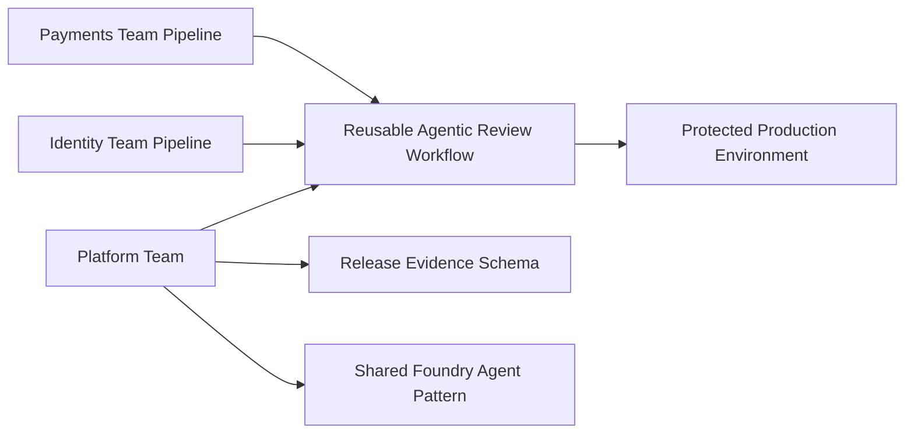

# Scaling Agentic DevOps Across Teams

The original demo proves a single-team Agentic DevOps workflow. Scaling across teams requires turning that workflow into a repeatable platform capability.

## What Was Added For Scaling

| Artifact | Purpose |
| --- | --- |
| `.github/workflows/reusable-agentic-release-review.yml` | A reusable GitHub Actions workflow that teams can call instead of copying release review logic |
| `.github/workflows/team-scaling-demo.yml` | A demo workflow showing two teams using the same reusable review pattern |
| `schemas/release-evidence.schema.json` | A shared contract for the release evidence each team should produce |

## Scaling Pattern

## Why This Matters

If every team builds its own agentic pipeline, the organization will eventually have inconsistent prompts, inconsistent risk scoring, uneven approval rules, and weak auditability.

The scalable architecture is different:

- The platform team owns the reusable workflow and release evidence contract.
- Product teams plug their CI/CD pipelines into the shared workflow.
- Foundry projects, agents, and RBAC are governed centrally or through clear team boundaries.
- GitHub environments enforce consistent approval gates.
- Review artifacts are preserved for audit and learning.

## How To Explain It

For one team, Agentic DevOps is a pipeline improvement.

For many teams, Agentic DevOps becomes a platform engineering capability:

- common workflow,
- common evidence schema,
- common guardrails,
- common approval pattern,
- common AI governance model.

That is the architectural answer for task `1890`.
